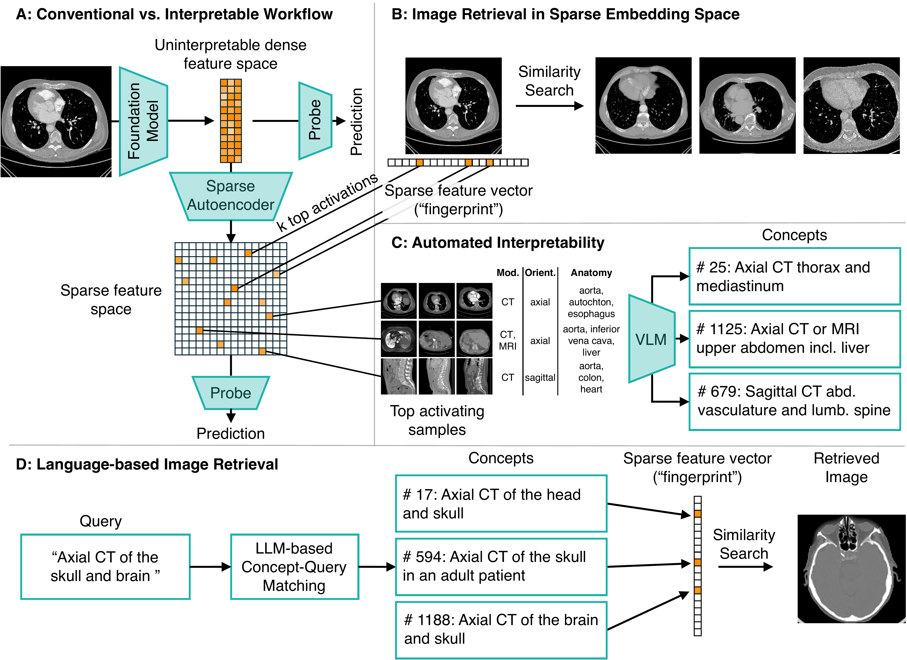

# SAIL: Sparse Autoencoders for Interpretable Medical Image Representation Learning

The **SAIL** repository provides a pipeline to train Matryoshka SAEs on BiomedParse (1536-dim) and DINOv3 (1024-dim) embeddings from the TotalSegmentator CT/MRI dataset, evaluate sparse features along two axes (monosemanticity and downstream utility), and run three interpretability demonstrations: sparse fingerprint retrieval, VLM-based feature autointerpretation, and zero-shot language-driven image retrieval. ([arXiv preprint](https://doi.org/10.48550/arXiv.2603.23794))

---

## 🔬 Background

Vision foundation models (FMs) achieve state-of-the-art performance in medical imaging, but encode information in abstract latent representations that clinicians cannot interrogate or verify. **SAIL** extracts sparse, monosemantic features from self-supervised FM embeddings using Sparse Autoencoders (SAEs), replacing opaque image representations with *human-interpretable concepts*.

<p align="center">
  
</p>

**Fig. 1.** (A) A Sparse Autoencoder replaces opaque dense FM embeddings with a sparse feature space. (B) Sparse fingerprint retrieval matches images by cosine similarity over *k* top-activated features. (C) A VLM generates a concept description for each feature from its top-activating images and metadata. (D) An LLM maps a clinical text query to matching feature concepts for zero-shot image retrieval.

---

## ⚙️ Installation

Two separate python environments are required. We use conda to manage dependencies.

### SAIL environment (Python 3.12), main environment

```bash
conda create -n sail python=3.12
conda activate sail
pip install torch torchvision torchaudio --index-url https://download.pytorch.org/whl/cu130
pip install -r requirements_sail.txt
```

### BiomedParse environment (Python 3.10), embedding extraction only

BiomedParse requirements are more complex and are based on older versions of Python, so we use a separate environment.

```bash
conda create -n biomedparse python=3.10
conda activate biomedparse
pip install torch torchvision torchaudio --index-url https://download.pytorch.org/whl/cu130
pip install --no-build-isolation git+https://github.com/MaureenZOU/detectron2-xyz.git
# Clone BiomedParse into BiomedParse/ and comment out detectron2-xyz in its requirements
git clone https://github.com/microsoft/BiomedParse.git
# Edit BiomedParse/assets/requirements/requirements.txt to comment out detectron2-xyz
pip install -r BiomedParse/assets/requirements/requirements.txt
pip install -r requirements_biomedparse.txt
```

---

## 📂 Data

Download the [TotalSegmentator dataset](https://github.com/wasserth/TotalSegmentator) (CT v2.0.1 and MRI v2.0.0) and place it under `TotalSegmentator/`:

```
TotalSegmentator/
├── CT_Dataset_v201/
│   ├── meta.csv
│   └── s0000/ ...
└── MRI_Dataset_v200/
    ├── meta.csv
    └── s0001/ ...
```

All processed data and embeddings will be written to `data/` (created automatically).

---

## ⬇️ Pretrained Weights

To skip SAE training, download the pretrained weights from [Hugging Face](https://huggingface.co/pwesp/sail) for the two models analyzed in the paper:

```bash
bash pretrained/download_weights.sh
```

This places checkpoints into `lightning_logs/` with the `hparams.yaml` files needed by Step 5, so `compute_sparse_feature_activations.py` discovers them automatically. Only the two optimal configurations analyzed in the paper are provided.

---

## 🚀 Pipeline

Run the following steps (1-12) in order to reproduce our results from the paper. All scripts are to be run from the repository root. Unless noted, use the `sail` environment:

```bash
conda activate sail
```

---

### Phase 1: Data Preparation

Raw TotalSegmentator CT and MRI scans are converted to 2D slices, passed through two foundation models to extract embeddings, and partitioned into reproducible train/val/test splits. These outputs are the inputs to all subsequent phases.

#### Process TotalSegmentator dataset (Step 1)

Extracts 2D axial, coronal, and sagittal slices from the CT and MRI volumes and writes them as PNG images with accompanying metadata.

```bash
python scripts/process_total_segmentator_ct_dataset.py
python scripts/process_total_segmentator_mri_dataset.py
```

Outputs to `data/total_seg_ct/` and `data/total_seg_mri/`.

#### Extract foundation model embeddings (Step 2)

Runs each slice through BiomedParse and DINOv3 and saves the resulting embedding vectors as Parquet files. A randomly initialized BiomedParse model is included as a baseline.

```bash
# BiomedParse (requires biomedparse environment)
conda activate biomedparse
python scripts/encode_totalseg_embeddings.py --model biomedparse
python scripts/encode_totalseg_embeddings.py --model biomedparse_random

# DINOv3 (sail environment)
conda activate sail
python scripts/encode_totalseg_embeddings.py --model dinov3
```

Outputs to `data/total_seg_{biomedparse,biomedparse_random,dinov3}_encodings/`.

#### Create train/val/test splits (Step 3)

Partitions the dataset into train, validation, and test sets and writes a split index that is shared across all three embedding datasets, ensuring identical assignments.

```bash
python scripts/create_datasplit_for_totalseg.py --model biomedparse
python scripts/create_datasplit_for_totalseg.py --model biomedparse_random
python scripts/create_datasplit_for_totalseg.py --model dinov3
```

The test set holds out institutions A, D, and E entirely. This institution-based split is stricter than a random split: scans from the same institution share acquisition protocols, scanner characteristics, and patient demographics, so a random split would risk the model exploiting these patterns rather than learning generalizable features. The remaining scans are split 80/20, stratified by modality, sex, and age group.

The first run writes the split index to `data/totalseg_split_index.csv`. Subsequent runs for other models load this index directly.

---

### Phase 2: SAE Training

Matryoshka Sparse Autoencoders are trained on the frozen foundation model embeddings. A grid search over dictionary sizes and sparsity levels produces a family of SAE configurations for each model, from which the best-performing configurations are selected in Phase 3.

#### Train Matryoshka SAE (Step 4)

Runs a grid search over dictionary sizes `[128, 512, 2048, 8192]` and sparsity levels for BiomedParse and DINOv3 embeddings. Checkpoints and hyperparameters are saved to `lightning_logs/`.

```bash
python scripts/train_matryoshka_sae.py
```

> To skip training, download pretrained weights for the two configurations analyzed in the paper (see [Pretrained Weights](#pretrained-weights)).

#### Compute sparse feature activations (Step 5)

Runs inference with all trained SAE checkpoints to produce sparse feature activation vectors for each slice in the train, val, and test sets.

```bash
python scripts/compute_sparse_feature_activations.py
```

Outputs to `results/total_seg_sparse_features/`.

---

### Phase 3: SAE Evaluation

SAE configurations are evaluated along two complementary axes: monosemanticity (do features encode single, coherent concepts?) and downstream utility (how much of the dense model's classification performance can sparse features recover?). The final step synthesizes both axes into a ranking that identifies the optimal configuration per foundation model.

#### Train linear probes (Step 6)

Fits logistic regression classifiers on both dense embeddings and sparse features for five classification tasks: imaging modality, slice orientation, patient sex, age group, and anatomical structure presence. These results feed into the performance recovery evaluation.

```bash
python scripts/train_linear_probes.py
```

Results saved to `results/linear_probes/`.

#### Evaluate monosemanticity (Step 7)

Scores every feature in every SAE configuration on two axes: semantic coherence (do the top-activating images share the same concepts?) and specificity (how narrow is the encoded concept?). The product of both scores gives a per-feature monosemanticity score, which is aggregated to configuration level.

```bash
python scripts/evaluate_monosemanticity.py
```

Outputs to `results/monosemanticity/`.

#### Evaluate performance recovery (Step 8)

Measures how downstream classification performance scales with the number of sparse features used, from a single feature up to the full dictionary. This quantifies how efficiently sparse features capture task-relevant information compared to the dense baseline.

```bash
python scripts/evaluate_performance_recovery.py
```

Outputs to `results/performance_recovery/`.

#### Rank SAE configurations (Step 9)

Combines the monosemanticity and performance recovery scores into a single ranking per foundation model. This produces Table 1 in the paper and identifies the optimal configuration used in all Phase 4 analyses.

```bash
python scripts/evaluate_sae_configs.py
```

Outputs to `results/config_ranking.csv`.

---

### Phase 4: Feature Interpretability Analysis

Using the optimal SAE configuration from Phase 3, three interpretability analyses are run. Together they show that sparse features can serve as a bridge between raw medical images and human-understandable concepts: they support image retrieval, can be described in natural language, and enable zero-shot language-to-image search.

#### Fingerprint-based image retrieval (Step 10)

Represents each image as a sparse fingerprint (top-K activated features and their values) over the SAE dictionary and evaluates retrieval quality by comparing fingerprint similarity against dense embedding similarity.

```bash
python scripts/evaluate_fingerprint_retrieval.py
```

Outputs to `results/fingerprint_retrieval/`.

#### Feature autointerpretation (Step 11)

Sends the top-activating images for each feature to a vision-language model, which generates a natural language description of what the feature detects. Features are ranked by combined monosemanticity and task importance before VLM calls begin, so the most interpretable features are described first.

```bash
# Requires a HuggingFace token with access to google/medgemma-27b-it
# Accept the license at https://huggingface.co/google/medgemma-27b-it
export HF_TOKEN=your_huggingface_token_here
python scripts/evaluate_autointerp.py
```

Outputs to `results/auto_interpretation/`.

#### Language-based image retrieval (Step 12)

Matches natural language clinical queries to sparse features using the descriptions from Step 11, then retrieves images by composing the matched features. Demonstrates zero-shot language-to-image retrieval without any retrieval-specific training.

```bash
python scripts/evaluate_language_retrieval.py
```

Requires autointerp outputs from Step 11. Also requires `HF_TOKEN` when `RUN_MATCHING=True` (first run). Outputs to `results/language_retrieval/`.

---

### Phase 5: Generate Figures

Reproduces the main manuscript figures from the precomputed results of Phases 3 and 4.

```bash
python scripts/plot_sae_quality_and_perf_rec.py
python scripts/plot_fingerprint_retrieval.py
```

Figures are saved to `results/`.

---

## 🗂️ Repository Structure

```
sail/
├── TotalSegmentator/               ← download separately (see Data section), gitignored
│   ├── CT_Dataset_v201/
│   └── MRI_Dataset_v200/
├── data/                           ← generated by scripts, gitignored
│   ├── total_seg_ct/
│   ├── total_seg_mri/
│   ├── total_seg_biomedparse_encodings/
│   ├── total_seg_biomedparse_random_encodings/
│   ├── total_seg_dinov3_encodings/
│   └── totalseg_split_index.csv
├── lightning_logs/                 ← generated by training, gitignored
├── pretrained/                     ← run download_weights.sh to populate, or train from scratch
│   └── download_weights.sh
├── results/                        ← generated by evaluation scripts (most of our results are provided)
│   ├── auto_interpretation/
│   ├── fingerprint_retrieval/
│   ├── language_retrieval/
│   ├── linear_probes/
│   ├── monosemanticity/
│   ├── performance_recovery/
│   └── *.pdf / *.csv               ← figures and summary tables
├── scripts/                        ← main pipeline scripts
│   ├── ...
├── src/                            ← utility scripts
│   ├── ...
├── requirements_sail.txt
└── requirements_biomedparse.txt
```

---

## 📚 References

- **TotalSegmentator CT**: Wasserthal et al. (2023). Robust segmentation of 104 anatomic structures in CT images. *Radiology: Artificial Intelligence* 5(5), e230024. [DOI](https://doi.org/10.1148/ryai.230024)
- **TotalSegmentator MRI**: Akinci D'Antonoli et al. (2025). Robust sequence-independent segmentation of multiple anatomic structures in MRI. *Radiology* 314(2), e241613. [DOI](https://doi.org/10.1148/radiol.241613)
- **BiomedParse**: Zhao et al. (2025). A biomedical foundation model for image parsing of everything everywhere all at once. *Nature Methods* 22(1), 166–176. [DOI](https://doi.org/10.1038/s41592-024-02499-w)
- **DINOv3**: Siméoni et al. (2025). DINOv3. [arXiv:2508.10104](https://arxiv.org/abs/2508.10104)
- **BatchTopK SAEs**: Bussmann et al. (2024). Flexible per-sample sparsity for sparse autoencoders. [arXiv:2412.06410](https://arxiv.org/abs/2412.06410)
- **Matryoshka SAEs**: Bussmann et al. (2025). Hierarchical nested dictionaries for multi-level feature learning. [arXiv:2503.17547](https://arxiv.org/abs/2503.17547)

---

## 📝 Citation

If you find this work useful, please cite our paper:

```bibtex
@misc{sail2026,
  title = {Sparse Autoencoders for Interpretable Medical Image Representation Learning},
  author = {Wesp, Philipp and Holland, Robbie and Sideri-Lampretsa, Vasiliki and Gatidis, Sergios},
  year = 2026,
  journal = {arXiv.org},
  howpublished = {https://arxiv.org/abs/2603.23794v1}
}
```